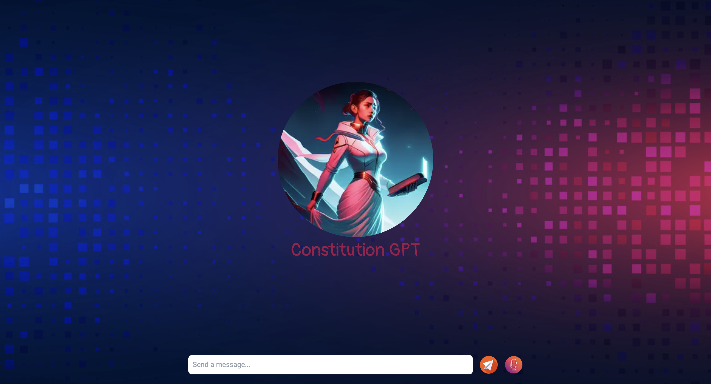
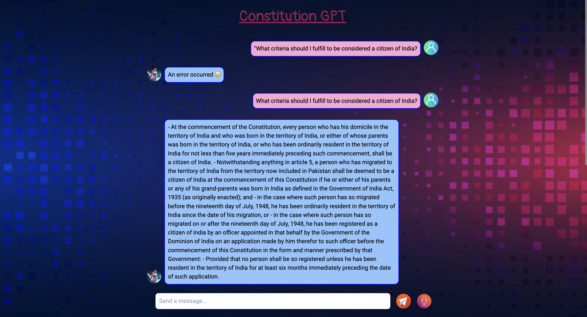
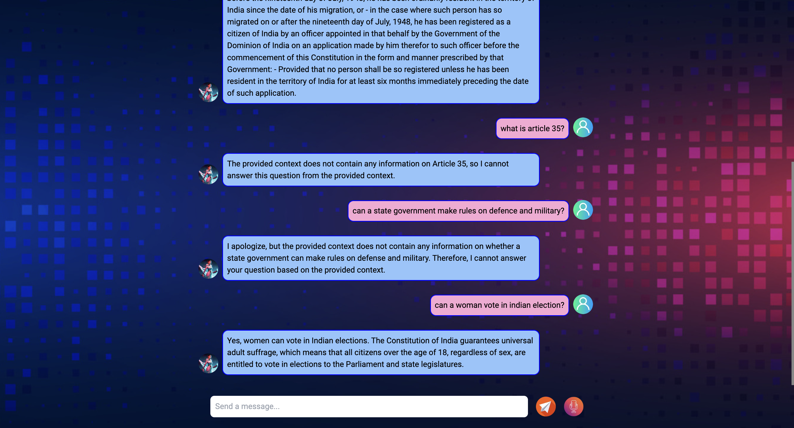

# Constitution GPT



- A **RAG (retrieval augmented generation)** project based on `Indian Constitution`.

---

## Some pics:




---

## Tech Stack 🧑🏻‍💻

- **Frontend:** Next.Js, Tailwind CSS, typescript
- **Backend**: FastAPI, Python, PostgreSQL(yet to be integrated), LangChain, Qdrant
- **Database:** PostgreSQL, Qdrant (`vector database`)
- **Docker & Docker-compose**

---

## Pre-setup

- Get your environment variables:
```bash
cp backend/.env.example backend/.env
```

- Go to Qdrant, and grab your api key & url. [Qdrant](https://cloud.qdrant.io/)
- Go to gemini and get your api key. [Gemini api key](https://ai.google.dev/?gad_source=1&gclid=CjwKCAjwte-vBhBFEiwAQSv_xXJ9-__L08kfhVvCFvl3NwJzYP_p17DGtM7VfTkdcTyk2-C3HJAe3xoCjeAQAvD_BwE)

- Install dependencies:
```bash
pip install -r requirements.txt
```

- Run the jupyter notebook, to generate embeddings of the `India's constitution pdf`. [Jupyter Notebook](./backend/qdrant_store_embeddings/qdrant_store_indian_constitution_pdf.ipynb)

- Once, Embeddings of pdf are done and have been stored in your qdrant cloud, you can run the docker compose.

---

## Run project:

- In development mode:

```bash
# up the containers
docker compose -f docker-compose-dev.yaml up

# down the containers and remove images
docker compose -f docker-compose-dev.yaml down --rmi local
```

- In production mode:
```bash
# up the containers
docker compose -f docker-compose-prod.yaml up

# down the containers and remove images
docker compose -f docker-compose-prod.yaml down --rmi local
```

---

If you liked the project, give it a star! ⭐️

- Have a great day, buddy! 🤝🤗